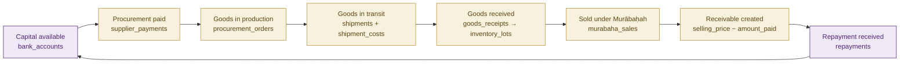
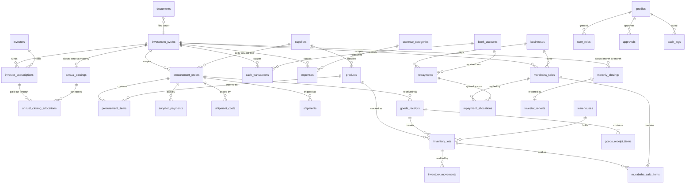

# Entity relationship diagram

Every financial row carries `investment_cycle_id`, so cycles never mix. Money
columns are `numeric(18,2)`; quantities are `numeric(18,3)`.

## The capital journey

## Core schema

## Where each figure comes from

| Dashboard figure | View | Source of truth |
|---|---|---|
| Cash at Hand | `v_financial_position` | `cash_transactions` + `bank_accounts.opening_balance` |
| Cash in Stock | `v_batch_position` | supplier payments + direct costs − value capitalised |
| Inventory Value | `v_inventory_valuation` | `(available + reserved) × unit_landed_cost` |
| Outstanding Receivables | `v_receivables` | `selling_price − amount_paid` on active contracts |
| Total Business Assets | `v_financial_position` | the four above plus `other_assets` |
| Gross profit | `v_financial_position` | Σ `murabaha_sales.markup_amount` |
| Operating expenses | `v_monthly_pl` | approved/paid expenses in non-direct categories |
| Capital cycle days | `v_batch_capital_cycle` | last repayment date − procurement date |

## Tables by area

**Access & configuration** — `profiles`, `user_roles`, `system_settings`,
`document_sequences`

**Investors** — `investment_cycles`, `investors`, `investor_subscriptions`

**Supply** — `suppliers`, `products`, `warehouses`

**Procurement** — `procurement_orders`, `procurement_items`, `supplier_payments`,
`shipments`, `shipment_costs`

**Inventory** — `goods_receipts`, `goods_receipt_items`, `inventory_lots`,
`inventory_movements`

**Sales** — `businesses`, `murabaha_sales`, `murabaha_sale_items`

**Money** — `bank_accounts`, `cash_transactions`, `repayments`,
`repayment_allocations`, `expense_categories`, `expenses`, `other_assets`

**Governance** — `documents`, `approvals`, `monthly_closings`,
`investor_reports`, `annual_closings`, `annual_closing_allocations`,
`notifications`, `audit_logs`
